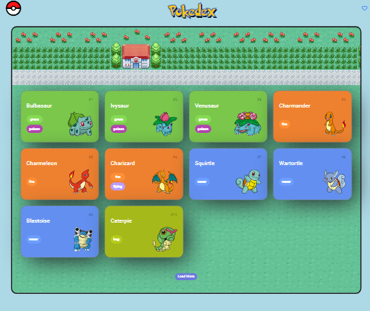
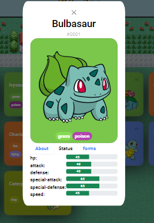

# Pokédex Web App

Este é um projeto de uma Pokédex, desenvolvido como parte de um desafio na plataforma DIO (Digital Innovation One). O objetivo deste projeto é criar uma aplicação web que exibe uma lista de Pokémon e suas informações detalhadas em um modal quando clicados.

https://js-developer-pokedex-virid-three.vercel.app

## Gif

## Funcionalidades Implementadas

1. Exibição da Lista de Pokémon: A aplicação carrega uma lista inicial de Pokémon com suas imagens, números e nomes. A lista é paginada, e o botão "Load More" permite carregar mais Pokémon.

2. Exibição Detalhada em um Modal: Quando um Pokémon na lista é clicado, um modal é aberto exibindo detalhes como nome, imagem, tipo, peso, altura e estatísticas. O modal pode ser fechado clicando no botão "Close".

## Estrutura do Projeto

- `index.html`: Contém a estrutura HTML da página, incluindo a lista de Pokémon e o modal.
- `assets/css/`: Diretório com os arquivos de estilos CSS.
  - `global.css`: Estilos globais da aplicação.
  - `pokedex.css`: Estilos específicos da lista de Pokémon.
  - `modal.css`: Estilos específicos do modal.
- `assets/js/`: Diretório com os arquivos de scripts JavaScript.
  - `pokemon-model.js`: Contém a definição do modelo de Pokémon.
  - `poke-api.js`: Contém a integração com a API PokeAPI para obter os dados dos Pokémon.
  - `main.js`: Contém a lógica principal da aplicação, carregamento dos Pokémon, e manipulação do modal.
  - `modal.js`: Contém a lógica específica para manipulação do modal.

## Como Executar o Projeto

1. Faça o download ou clone o repositório em seu computador.
2. Abra o arquivo `index.html` em um navegador web.

## Tecnologias Utilizadas

- HTML
- CSS (Bootstrap)
- JavaScript (ES6)

